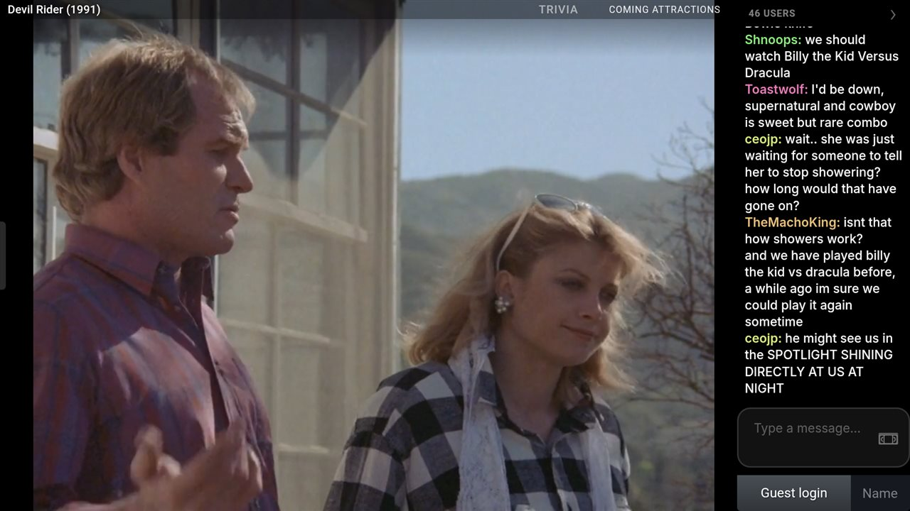
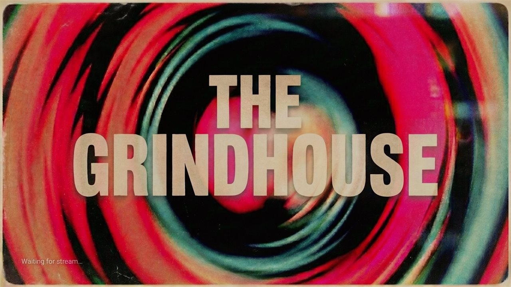
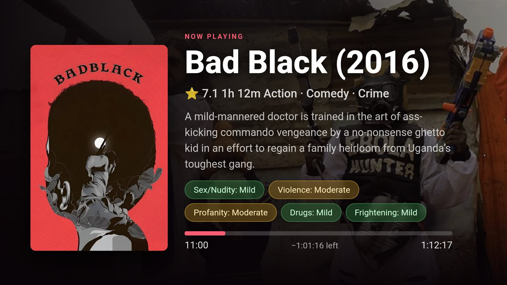
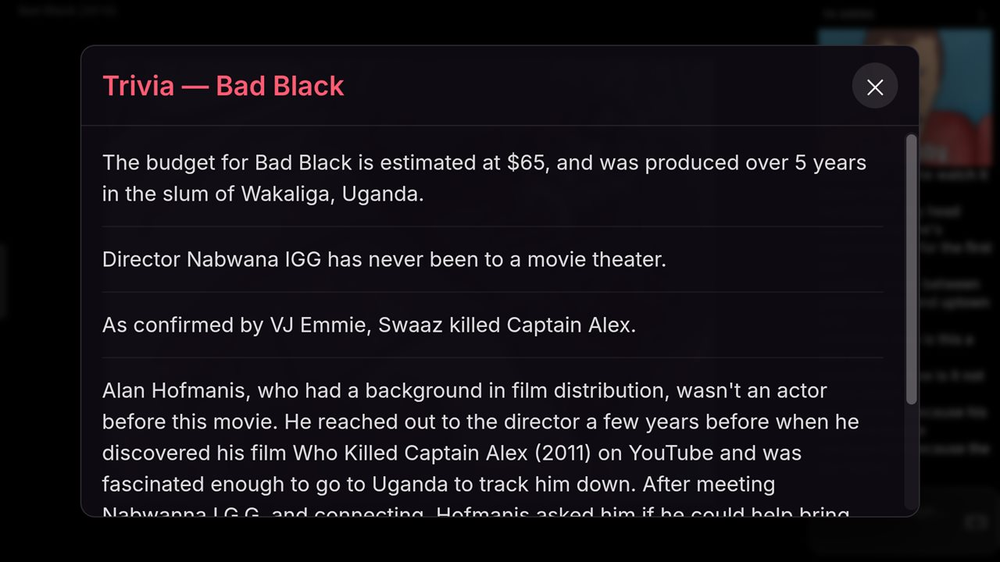
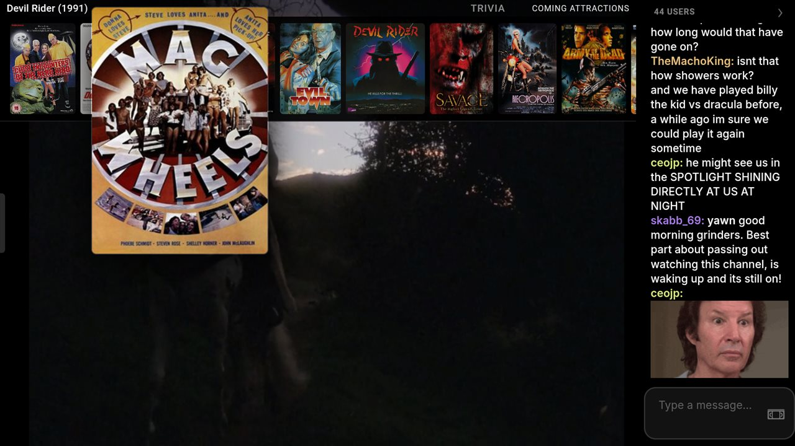
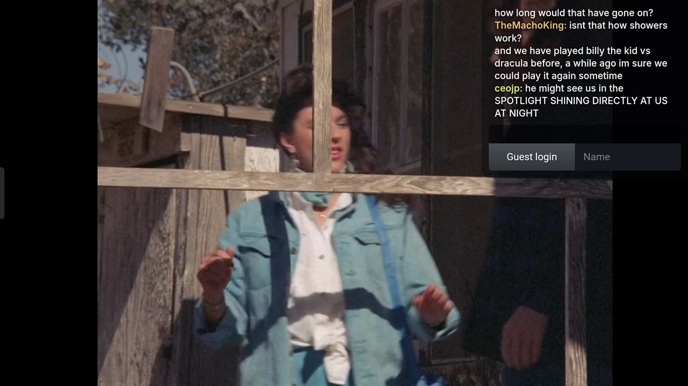
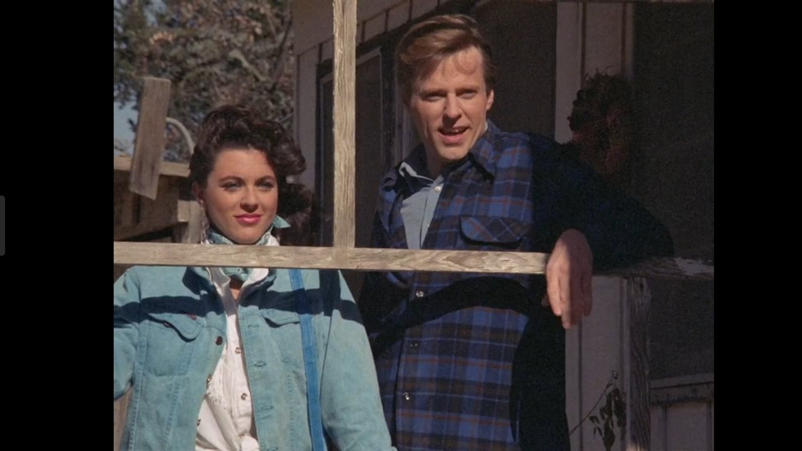
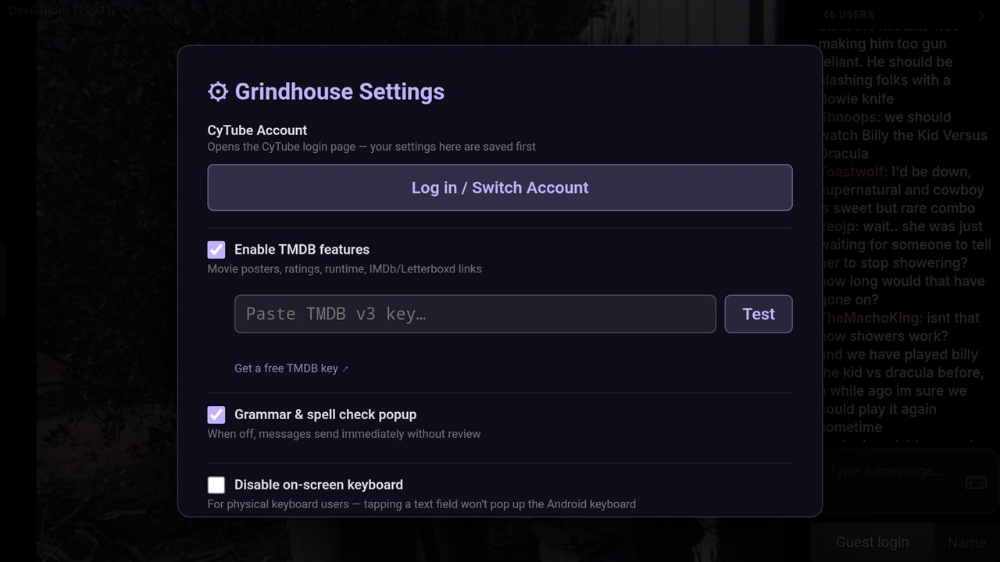

# Grindhouse

A native **Android app for [CyTube](https://cytu.be)** — built for the couch on **Android TV** and tuned for **phones** too. It wraps a CyTube channel in a clean, cinematic shell so a watch‑party feels like a real streaming app instead of a web page.

> One app, two skins: it detects Android TV (Leanback) vs. phone at runtime and adapts the whole layout, controls, and chrome accordingly.



## Features

- **Cinematic shell** — branded splash that holds until the video is actually playing, then a 3‑second *Now‑Playing* intro card (TMDB backdrop, rating, runtime, genres).
- **Four chat layouts** — cycle **Sidebar → Overlay → Hidden → Chat‑Only** (press `C` or the on‑screen control): a translucent corner overlay, full‑bleed cinema, or a keyboard‑free **full‑screen chat** that pauses and mutes the video — handy for using a TV purely as a chat client.
- **Cast to TV** — from a phone or tablet, send the current video to a Chromecast / Google TV with one tap; the handset becomes a chat remote while the movie plays on the big screen. *(Experimental.)*
- **Update notifications** — quietly checks GitHub for a newer release and briefly highlights the ⚙ settings gear; the release notes and a one‑tap **download link** live in Settings → App Updates.
- **Grammar & spell check** — an optional *Review Before Sending* popup (powered by [LanguageTool](https://languagetool.org)) that catches typos and grammar slips, suggests one‑tap fixes, and flags hard‑to‑read messages (ALL CAPS, mashed keys, `!!!!`). Toggle it off in settings.
- **IMDb Parent Guide & Trivia** — severity chips (Sex/Violence/Profanity/Drugs/Frightening) on the card, plus a summonable Trivia panel (`T` or the title link).
- **Auto title cleanup** — pulls clean titles, posters, and IMDb/Letterboxd/Wiki links from TMDB; even attempts a match for full‑length YouTube movies.
- **TV‑first controls** — left‑edge control drawer, auto‑hiding chrome, larger type, focus rings, lock‑screen‑friendly playback.
- **Physical keyboard friendly** — optional on‑screen‑keyboard suppression so a hardware keyboard/mouse setup doesn't pop the soft keyboard.
- **Picture‑in‑Picture** on phones; clean exit on TV.

## Screenshots

**Branded splash** — holds until the video is actually playing, with a quiet status line in the corner showing where it is in the load.



**Now‑Playing card** — TMDB poster, rating, runtime, and genres, an IMDb Parent Guide severity chip, and a live progress bar.



**IMDb Trivia** — a summonable, scrollable panel of trivia for the current film (`T` or the title link).



**Coming Attractions** — a D‑pad‑navigable reel of upcoming posters across the top.



**Chat layouts** — cycle Sidebar → Overlay → Hidden → Chat‑Only with `C`.

| Overlay | Hidden (cinema) |
|---|---|
|  |  |

**Settings** — add a free TMDB key, toggle features, and log in to CyTube.



## Install

Grindhouse isn't on the Play Store, so you'll install the APK directly ("sideloading"). The same APK works on phones and Android TV — on TV it shows up on the home row with its own banner. Requires **Android 10+**.

> **A note on the warnings you'll see.** Android shows a few prompts for any app installed outside the Play Store. These are expected — they mean "this developer isn't recognized by Google," **not** that anything is wrong with the app. You'll click through them once. To be sure you have the genuine file, only download it from the [official releases page](../../releases/latest), and you can verify it against the **SHA‑256 checksum** listed in each release's notes (see [Verify the download](#verify-the-download-optional) below).

### On a phone or tablet

1. Open the [latest release](../../releases/latest) and download `grindhouse-v<version>.apk`.
2. If your browser warns **"This type of file can harm your device"**, choose **Download anyway** — it's just the standard warning for any `.apk`.
3. Tap the downloaded file. The first time, Android will say the source (your browser or file manager) **isn't allowed to install apps** — tap **Settings**, enable **Allow from this source**, then back out.
4. Tap **Install**. If **Play Protect** pops up with *"Unsafe app blocked"* or *"unknown developer,"* tap **More details → Install anyway**. (Leaving Play Protect on and letting it scan is the safe, recommended path — you're just acknowledging an unknown developer, not turning off security.)
5. Open Grindhouse and you're set.

### On Android TV / Google TV

TV devices don't ship with a browser, so the easiest path is the free **Downloader** app (by AFTVnews):

1. From the Play Store on your TV, install **Downloader**.
2. Open **Settings → Apps → Security & restrictions → Unknown sources** and enable **Downloader** (Android TV may prompt you for this automatically the first time).
3. In Downloader, enter the direct APK URL from the [latest release](../../releases/latest) (long‑press the asset on the releases page to copy its link, or type the short URL).
4. Downloader fetches the APK and offers to install it — choose **Install**. Click through the same **Play Protect / unknown developer** prompt as above (**More details → Install anyway**).
5. After installing, you can delete the downloaded APK when Downloader offers, to save space.

## Settings

Open the **⚙ settings** (in the control drawer) to:

- Add a free **TMDB API key** (unlocks posters, backdrops, links, and the info card).
- Toggle movie links, the on‑screen keyboard, grammar review, and chat font size.
- Log in to / switch CyTube accounts.
- Check for app updates and read the latest **release notes** (with a download link).

IMDb Parent Guide and Trivia need no key.

## Build from source

Open the project in **Android Studio** and hit Run, or from the command line:

```bash
./gradlew assembleDebug      # development build
./gradlew assembleRelease    # signed release (requires keystore.properties — see below)
```

Release signing reads a git‑ignored `keystore.properties` (pointing at a local keystore). Debug and release install **side by side** (the debug build uses a `.debug` package id), so you can develop without touching the installed release.

## How it works

It's a `WebView` wrapper that loads a CyTube channel and injects a single styling/behavior script (`app/src/main/assets/cytube_mobile.js`). A small native bridge handles secure key storage, the soft‑keyboard control, and CORS‑free HTTP for the IMDb/TMDB lookups.

## Notes

- IMDb data is fetched from IMDb's public GraphQL endpoint and is **for personal, non‑commercial use** per their terms.
- This is a hobby project and isn't affiliated with CyTube, IMDb, or TMDB.
